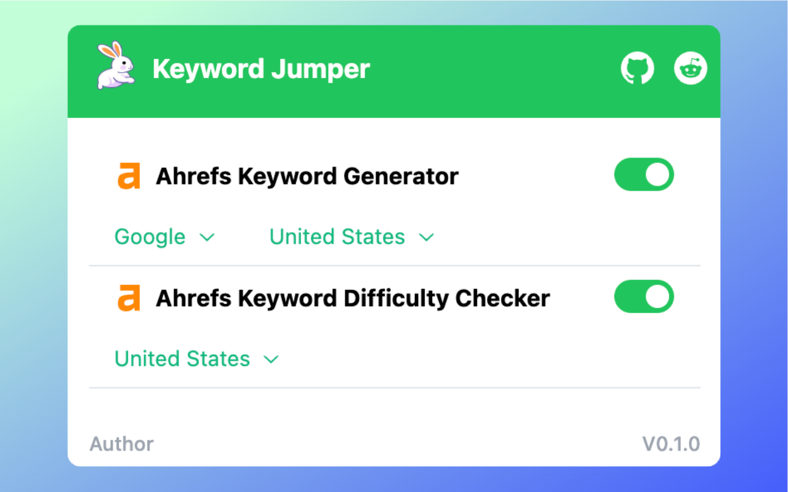

<p align="center">

</p>
<h1 align="center">Keyword Jumper</h1>

## Introduction

Open-source browser extension providing rapid access to keyword information.



✓ **Absolutely free:** open-sourced under the MIT license.

✓ **Privacy-friendly**: data is securely stored locally, no need for extra permissions.

✓ **Granular control**: enabling the option to toggle each tool on and off.

✓ **Multiple ways of use**: button, right-click menu, shortcut key

<iframe width="560" height="315" src="https://www.youtube.com/embed/sgf3WHkdqUg?si=gkc1NcSBfW1ec-WV" title="YouTube video player" frameborder="0" allow="accelerometer; autoplay; clipboard-write; encrypted-media; gyroscope; picture-in-picture; web-share" referrerpolicy="strict-origin-when-cross-origin" allowfullscreen></iframe>

## Start
use pnpm

```
pnpm i
pnpm dev
```

or use npm

```
npm install
npm run dev
```

Also refer to: https://docs.plasmo.com/framework/workflows/dev

## Author

**Keyword Jumper** © [coycs](https://twitter.com/icoycs), Released under the [MIT](./LICENSE) License.<br>
